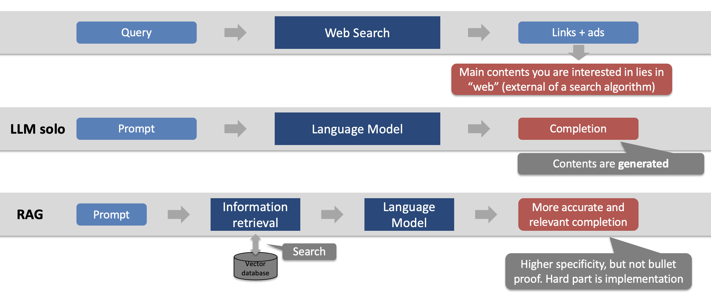

# Life Valuation Actuarial Document Q&A machine using Retrieval Augmented Generation (RAG)
## 1. Description
This project aims to create a Retrieval-Augmented Generation (RAG) process for actuaries to ask questions on a set of Life Valuation Actuarial documents. The RAG process utilizes the power of the Large Language Model (LLM) to provide answers to questions on the documents.

The collections include:
- [Actuarial Standards of Practice related to Life Insurance](./data/ASOP_Life)
- [Cash Flow Testing and Asset Adequacy Testing](./data/CFT)
- [NAIC Valuation Manual 21](./data/VM21)
- [NAIC Valuation Manual 22](./data/VM22)
- [NAIC Asset Primers](./data/Asset)
- [Bermuda Economic Balance Sheet framework for Long-term Insurers](./data/Bermuda)
- [IFRS 17](./data/IFRS17)

However, RAG is not without challenges, i.e., hallucination and inaccuracy. The project example allows verifiability by providing the context an LLM used to arrive at those answers. This process enables actuaries to validate the LLM's answers, empowering them to make informed decisions. By combining the capabilities of LLM with verifiability, this RAG process offers actuaries a robust tool to leverage LLM technology effectively and extract maximum value.

The current example uses OpenAI's GPT 3.5 turbo.

The RAG process used LangChain, which is a framework for developing applications powered by LLMs.

## 2. Output
### 2.1 Demo App
  
Explore the potentials of RAG by visiting the Streamlit web app (https://valact-search.streamlit.app/) powered by GPT 3.5 turbo.

## 3. Model
### 3.1 Conceptual Flow
RAG combines search and LLM generations.  

LLM completions are the results of model inference based on locked-in parameters. Any knowledge or information from LLM can be outdated unless augmented by external sources. RAG connects external documents, searches the document, and provides the relevant context to LLM. The external documents are transformed into a vector database during the initial setup stage for an effective search.  

For applications in practice, one should note that RAG is not perfect and can still lead to errors in searching or generating irrelevant or incorrect responses. As such, verifiability in RAG becomes crucial for actuarial use cases.

### 3.2 RAG Implementation Steps
    1. Select PDF documents from a collection to perform RAG (use Jupyter notebook)
    2. Transform PDF into texts and divide them into chunks (use Jupyter notebook)
    3. Convert the chunks into a vector database (Chroma DB) using OpenAI embedding model (use Jupyter notebook)
    4. Retrieve and use LLM (GPT 3.5 Instruct) to generate
    5. Output responses and context for a user to verify

## 4. Author
Dan Kim 

- [@LinkedIn](https://www.linkedin.com/in/dan-kim-4aaa4b36/)
- dan.kim.actuary@gmail.com (feel free to reach out with questions or comments)

## 5. Date
- Initially published on 3/2/2024
- The contents may be updated from time to time
  
## 6. License
This project is licensed under the Apache License 2.0- see the LICENSE.md file for details.

## 7. Acknowledgments and References
- https://python.langchain.com/docs/use_cases/question_answering/quickstart
- https://python.langchain.com/docs/use_cases/question_answering/sources
- https://chat.langchain.com/
- https://ollama.ai/
- https://www.trychroma.com/
