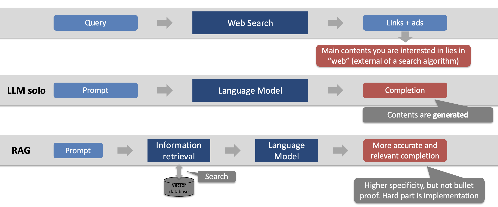

# Life Valuation Actuarial Document Q&A machine using Retrieval Augmented Generation (RAG)
## 1. Description
This project aims to create a Retrieval-Augmented Generation (RAG) process for actuaries to ask questions about a set of Life Valuation Actuarial documents. The RAG process utilizes the power of the large language model (LLM) to provide quick answers to questions about the documents.

The collections include:
- [Statutory Accounting Principles](./data/pdf/SAP)
- [Principle-Based Reserving](./data/pdf/PBR)
- [Cash Flow Testing and Asset Adequacy Testing](./data/pdf/CFT)
- [Actuarial Standards of Practice related to Life Insurance](./data/pdf/ASOP_life)
- [US GAAP](./data/pdf/GAAP)
- [IFRS 17](./data/pdf/IFRS17)
- [Bermuda](./data/pdf/Bermuda)
- [Cayman and CIMA documents](./data/pdf/Cayman/)
- [Asset related documents](./data/pdf/Asset)
- [Liability Products](./data/pdf/Product)
- [Risk and Finance including Capital and Reinsurance](./data/pdf/RiskFinance)
- [AI and Big Data](./data/pdf/AI_BigData)

However, RAG is not without challenges, i.e., hallucination and inaccuracy. The project allows verifiability by providing the context an LLM used to arrive at those answers. This process enables actuaries to validate the LLM's answers, empowering them to make informed decisions. By combining the capabilities of LLM with verifiability, this RAG process offers actuaries a robust tool to leverage LLM technology effectively and extract maximum value.

The current example uses an Anthropic Claude model with a long context window suitable for understanding lengthy actuarial documents and citing across multiple sources in a single answer. The specific Claude version is configured in `valact/settings.py` (`ANTHROPIC_MODEL`) and may be updated over time as newer releases become available.

The retrieval pipeline calls Pinecone, Voyage, Cohere, and Anthropic SDKs directly (no LangChain orchestration layer in the hot path) for low latency. Documents are chunked with `langchain-text-splitters` during ingestion only.

## 2. Output
### 2.1 Demo App
[](https://valact-search.streamlit.app/)  
Explore the potentials of RAG by visiting the Streamlit web app (https://valact-search.streamlit.app/), powered by Anthropic Claude.

## 3. Model
### 3.1 Conceptual Flow
RAG combines search and LLM generations.  

LLM completions are the results of model inference based on locked-in parameters. Any knowledge or information from LLM can be outdated unless augmented by external sources. RAG connects external documents, searches the document, and provides the relevant context to LLM. The external documents are transformed into a vector database during the initial setup stage for an effective search.  

For applications in practice, one should note that RAG is not perfect and can still lead to errors in searching or generating irrelevant or incorrect responses. As such, verifiability in RAG becomes crucial for actuarial use cases.



### 3.2 RAG Implementation Steps
    1. Select PDF documents from a collection to perform RAG
    2. Convert PDFs to Markdown for effective loading (MathPix preserves formulas and tables better than open-source tooling)
    3. Split each Markdown file by section headers (#, ##, ###); sub-split any header block longer than ~1,200 tokens into ~800-token chunks with 100-token overlap (true tiktoken token counts)
    4. Embed each chunk with Voyage AI's voyage-finance-2 model (1024 dim, finance-tuned) and upsert to Pinecone (cosine similarity, one namespace per collection); also store the original header block as a "parent" in a sidecar JSONL for later expansion
    5. At query time: retrieve top-40 candidates from Pinecone (optional MMR diversity), rerank to top-10 with Cohere rerank, expand each to its parent header block, and stream the answer from Anthropic Claude with prompt caching on the system + context block
    6. Output the response alongside the cited source sections for the user to verify

### 3.3 Pipeline Diagram
```
PDF -> Markdown -> chunk + parent block
                          |
                          v
                  Voyage voyage-finance-2 (1024d)
                          |
                          v
                  Pinecone (per-collection namespaces)
                          |
   query --> embed --> top_k=40 --> Cohere rerank --> top_n=10
                                                          |
                                                          v
                                        parent-block expansion (sidecar JSONL)
                                                          |
                                                          v
                                 Anthropic Claude (streamed, prompt-cached)
```

### 3.4 Local Development
```
# Ingestion (one-time, or per-collection re-runs):
python -m ingest.run --all --purge               # full rebuild
python -m ingest.run --collection SAP            # one collection
python -m ingest.run --collection SAP --file F.pdf  # one file (idempotent)

# Run the app:
streamlit run Valuation_search.py

# Latency benchmark:
python scripts/bench.py --runs 2
```

Required secrets (in `.streamlit/secrets.toml` locally, or Streamlit Cloud dashboard for production): `ANTHROPIC_API_KEY` (chat LLM), `PINECONE_API_KEY` (vector store), `COHERE_API_KEY` (reranker), `VOYAGE_API_KEY` (embeddings), `FRED_API_KEY` (yield-data page). `OPENAI_API_KEY` is optional — only used if you switch `EMBED_PROVIDER` back to `"openai"` in `valact/settings.py`.

## 4. Author
Dan Kim 

- [@LinkedIn](https://www.linkedin.com/in/dan-kim-4aaa4b36/)
- dan.kim.actuary@gmail.com (feel free to reach out with questions or comments)

## 5. Date
- Initially published on 3/2/2024
- The contents may be updated from time to time
  
## 6. License
This project is licensed under the Apache License 2.0- see the LICENSE.md file for details.

## 7. Acknowledgments and References
- Anthropic Claude — https://docs.anthropic.com/
- Voyage AI embeddings (voyage-finance-2) — https://docs.voyageai.com/
- Cohere Rerank — https://docs.cohere.com/docs/rerank-2
- Pinecone vector database — https://docs.pinecone.io/
- MathPix Markdown PDF conversion — https://mathpix.com/
- LangChain text splitters (header-aware chunking) — https://python.langchain.com/docs/concepts/text_splitters/
